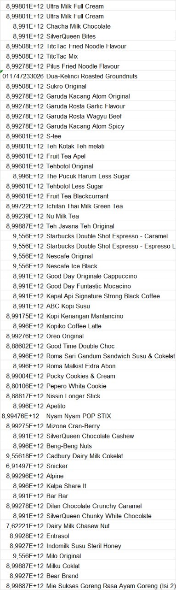

# ScanEat - Cloud Computing


## Introduction

ScanEat is a web-based app designed to help consumers make the best nutritional choices to meet their personalized dietary needs, especially on high-fat-sugar-salt (HFSS) products by scanning the barcode of the product. Providing customized food recommendations based on macronutrient content and individual preferences, ScanEat enables users to make informed choices about products available at convenience stores.

---

## Table of Contents

- [ScanEat - Cloud Computing](#scaneat---cloud-computing)
  - [Introduction](#introduction)
  - [Table of Contents](#table-of-contents)
- [Cloud Infrastructure](#cloud-infrastructure)
- [Setup Clone Project](#setup-clone-project)
    - [Steps](#steps)
  - [Deploying to Cloud Run](#deploying-to-cloud-run)
  - [Prediction Classes](#prediction-classes)
- [API Reference](#api-reference)
    - [Food Prediction](#food-prediction)
  - [API Documentation](#api-documentation)
- [Cloud Team](#cloud-team)
  - [Contributing](#contributing)
  - [UI/UX Design](#uiux-design)
  - [Deployment Link Website](#deployment-link-website)
  - [Languages and Tools:](#languages-and-tools)
- [🔥 Supported By](#-supported-by)
  - [License](#license)

---

# Cloud Infrastructure


---
# Setup Clone Project 
To run this project, clone the repository and install the required dependencies.

### Steps
```bash
# Clone the repository
git clone https://github.com/ScanEat-team/ScanEat-ml-server.git

# Install server dependencies
pip install requirements.txt

```
---

---
## Deploying to Cloud Run
- ### Preconditions
  Before deploying your app to Google Cloud Run, ensure that you meet the following prerequisites:
  - Create a Google Cloud Platform (GCP) account and manage projects.
  - Install and configure the Google Cloud SDK on your local machine.
    
  >  Please note that "prerequisites" is a plural noun, so it is more appropriate to use "meet the following prerequisites" instead of "meet the following prerequisite" in this context.

- ### Steps
  - Prepare the application
    Ensure that your application is ready for deployment on Google Cloud Run. This involves conducting local testing and ensuring that the necessary configuration is in place.
  - Create a container image
    Google Cloud Run requires the application to be packaged as a distributable container image. Build container images of your applications using tools like Docker.
  - Upload the container image
    Upload the container image you created to the Google Container Registry (GCR) using the gcloud command. Before proceeding, ensure that you are signed in to the correct Google Cloud Platform (GCP) account.
    Example command to upload a container image:
    ```
    gcloud builds submit --tag gcr.io/[PROJECT-ID]/[IMAGE-NAME]
    ```
  - Deploy to Google Cloud Run
    Use the gcloud run deploy command to deploy your application to Google Cloud Run. Specify the service name, select the uploaded container image, and configure any additional options as necessary.
    Example command to deploy an application to Google Cloud Run:
    ```
    gcloud run deploy [SERVICE-NAME] --image gcr.io/[PROJECT-ID]/[IMAGE-NAME] --platform managed
    ```
  - Accessing the application
    After the deployment process is complete, you will receive a URL that provides access to the deployed application. Utilize this URL to access the app through a web browser or by employing an API testing tool such as cURL or Postman.

---

## Prediction Classes

The API supports classification for upc product realated classes:

`upc`

- 

---
# API Reference 

### Food Prediction 

| Route                           | HTTP Method | Description                                  |
|---------------------------------|-------------|----------------------------------------------|
| `/predict_food`                 | POST        | Predict food using the ML server             |
| `/predict`                      | POST        | Predict food                                 |

---
## API Documentation

- **Complete Documentation**:  
  [Full API Documentation](https://documenter.getpostman.com/view/40292260/2sAYHxmNxy)  

# Cloud Team

|Member|  Student ID  |Path|Contacts|
| :-----------------------------: | :----------: | :--------------:  | :--------------------------------------------------------------------------------------------------: |
|   I Putu Aditya Cahya Milano    | C113B4KY1869 | Cloud Computing    |      [LinkedIn](https://www.linkedin.com/in/aditmilano) or [Github](https://github.com/AditMilano)          |
| Muhammad Noor Abdi Ash Shafary  | C467B4KY2972 | Cloud Computing   |       [LinkedIn](https://www.linkedin.com/in/muhammad-noor-abdi-ash-shafary-8a58a6257/) or [Github](https://github.com/NoorAbdi)         |
|          Eric Armando           | C204B4KY1268 | Cloud Computing   |            [LinkedIn](https://www.linkedin.com/in/eric-armando-08bb49197/) or [Github](https://github.com/Xpemburu)               |
|    Andrew Haposan Indrajaya     | C008B4KY0527 | Cloud Computing  |              [LinkedIn](https://www.linkedin.com/in/andrew-haposan-indrajaya-68814b247/) or [Github](https://github.com/AndrewHaposan)               |


## Contributing
We welcome contributions to improve this API. To contribute:
1. Fork the repository.
2. Create a new branch for your feature or bug fix.
3. Submit a pull request describing your changes.

---
## UI/UX Design

- Link Prototype Design : [Prototype](https://www.figma.com/design/j9dcfgEwXPNj7ceYi59o7b/Capstone-Design?node-id=473-282&t=bR4aZisyNGUu5y2v-1)

## Deployment Link Website

Web ScanEat :<br>
[Website](https://scaneats-website-421390099984.asia-southeast2.run.app/index.html)


## Languages and Tools:
<p align="left"> <a href="https://developer.android.com" target="_blank" rel="noreferrer">  </a> <a href="https://www.docker.com/" target="_blank" rel="noreferrer">  </a> <a href="https://www.figma.com/" target="_blank" rel="noreferrer">  </a> <a href="https://firebase.google.com/" target="_blank" rel="noreferrer">  </a>  <a href="https://cloud.google.com" target="_blank" rel="noreferrer">  </a> <a href="https://git-scm.com/" target="_blank" rel="noreferrer">  </a> <a href="https://developer.mozilla.org/en-US/docs/Web/JavaScript" target="_blank" rel="noreferrer">  </a> <a href="https://kotlinlang.org" target="_blank" rel="noreferrer">  </a> <a href="https://postman.com" target="_blank" rel="noreferrer">  </a> <a href="https://www.python.org" target="_blank" rel="noreferrer">  </a> <a href="https://www.tensorflow.org" target="_blank" rel="noreferrer">  </a> <a href="https://fastapi.tiangolo.com" target="_blank" rel="noreferrer">  </a> <a href="https://hapi.dev" target="_blank" rel="noreferrer">  </a> </p>


# 🔥 Supported By


<div align="center">
  
  
  
</div>

## License
This project is licensed under the MIT License. See the `LICENSE` file for more details.
